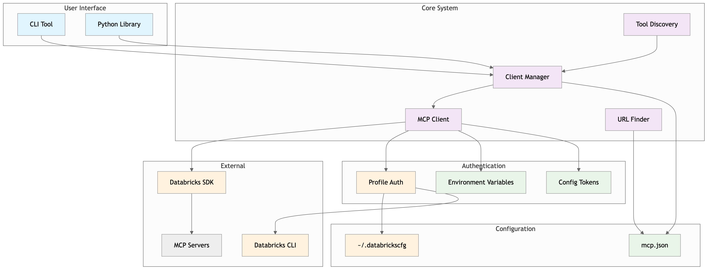
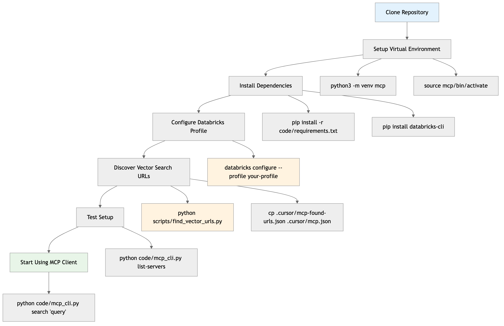
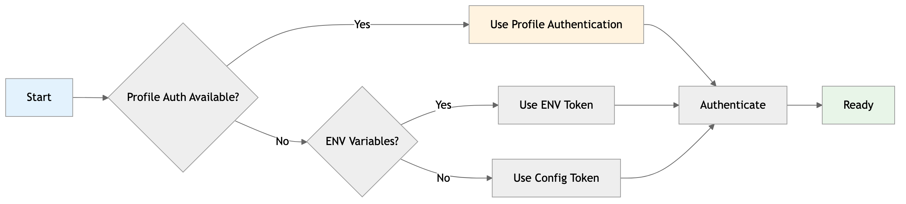

# MCP (Model Context Protocol) Client for Databricks

A clean, well-structured Python client for interacting with Databricks MCP servers. This project provides tools to discover, explore, and interact with MCP endpoints, including tool listing, schema viewing, and tool execution.

## 🚀 Features

- **🔍 Tool Discovery**: List all available tools on MCP servers
- **🔄 Auto-Discovery**: Automatically discover and cache tool information
- **📋 Schema Inspection**: View detailed tool schemas and properties
- **⚡ Tool Execution**: Execute tools with custom parameters
- **🎯 Interactive Mode**: Command-line interface for easy interaction
- **🌐 Multi-Server Support**: Work with multiple MCP servers simultaneously
- **📊 Result Display**: Formatted display of tool execution results

## 📁 Project Structure

```
mcp-unity-catalog/
├── .cursor/
│   └── mcp.json                 # MCP server configuration
├── code/
│   ├── mcp_client.py            # Core MCP client library
│   ├── mcp_cli.py              # Command-line interface
│   ├── mcp_discovery.py         # Tool discovery and config updater
│   └── requirements.txt         # Python dependencies
├── scripts/
│   ├── setup_venv.sh           # Environment setup script
│   ├── setup_env.sh            # Environment variable setup helper
│   ├── load_env.sh             # Dynamic environment loader
│   └── load_env_simple.sh      # Simple environment loader
├── docs/
│   ├── architecture.md         # System architecture diagrams
│   ├── workflows.md            # Workflow diagrams
│   └── diagrams.md             # Quick reference diagrams
├── env.example                 # Environment variables example
└── README.md                   # This file
```

## 📊 Visual Documentation

For detailed visual documentation of the system architecture and workflows, see:
- **[📋 Quick Diagrams](docs/diagrams.md)** - Overview and key diagrams
- **[🏗️ Architecture](docs/architecture.md)** - Detailed system architecture
- **[🔄 Workflows](docs/workflows.md)** - Step-by-step workflow diagrams
- **[🖼️ Generated Images](docs/images/README.md)** - High-resolution PNG and SVG diagrams
- **[🔐 Profile Authentication](docs/databricks-profile-auth.md)** - Databricks profile authentication guide
- **[🧪 Test Results](docs/profile-auth-test-results.md)** - Comprehensive test results

### **Key System Overview**



*Complete system architecture showing all components and authentication methods*

## 🛠️ Installation

### 🚀 **First Time Setup**

For complete step-by-step instructions, see: **[📖 First-Time Setup Guide](docs/first-time-setup.md)**

### 0. Repository Setup (First Time)

```bash
# Clone the repository
git clone <repository-url>
cd mcp-unity-catalog

# Run cleanup to remove any temporary files
./scripts/cleanup.sh
```

### 1. Quick Setup (5 minutes)



*Complete 5-minute setup process with profile authentication and URL discovery*

```bash
# Create and activate virtual environment
python3 -m venv mcp
source mcp/bin/activate  # On Windows: mcp\Scripts\activate

# Install dependencies
pip install -r code/requirements.txt

# Optional: Install development dependencies
# pip install -r code/requirements-dev.txt

# Install Databricks CLI
pip install databricks-cli

# Configure your profile
databricks configure --profile your-profile-name

# Copy and edit configuration
cp .cursor/mcp-profile-working.json .cursor/mcp.json

# Option A: Use the URL finder script (recommended)
python scripts/find_vector_urls.py
cp .cursor/mcp-found-urls.json .cursor/mcp.json

# Option B: Edit manually
# Edit .cursor/mcp.json with your vector search URLs

# Test your setup
python code/mcp_cli.py list-servers
```

**📖 For detailed setup instructions, see [First-Time Setup Guide](docs/first-time-setup.md)**

### 2. Alternative: Using Setup Script

```bash
# Make the setup script executable
chmod +x scripts/setup_venv.sh

# Run the setup script
./scripts/setup_venv.sh
```

## ⚙️ Configuration

The MCP client reads configuration from `.cursor/mcp.json`. The configuration supports multiple authentication methods and server endpoints.

### **Profile-Based Configuration (Recommended)**

```json
{
  "mcpServers": {
    "wikipedia-search": {
      "type": "streamable-http",
      "url": "https://your-workspace.cloud.databricks.com/api/2.0/mcp/vector-search/your-catalog/your-schema",
      "headers": {
        "Authorization": "Bearer ${PROFILE_TOKEN}"
      },
      "profile": "your-profile-name",
      "note": "Databricks MCP server using profile authentication"
    }
  }
}
```

### **Environment Variable Configuration**

```json
{
  "mcpServers": {
    "wikipedia-search": {
      "type": "streamable-http",
      "url": "https://your-workspace.cloud.databricks.com/api/2.0/mcp/vector-search/your-catalog/your-schema",
      "headers": {
        "Authorization": "Bearer ${MCP_WIKIPEDIA_SEARCH_TOKEN}"
      }
    }
  }
}
```

### **Direct Token Configuration**

```json
{
  "mcpServers": {
    "wikipedia-search": {
      "type": "streamable-http",
      "url": "https://your-workspace.cloud.databricks.com/api/2.0/mcp/vector-search/your-catalog/your-schema",
      "headers": {
        "Authorization": "Bearer your-token-here"
      }
    }
  }
}
```

### 🔐 Authentication Options

The MCP client supports multiple authentication methods, with **Databricks Profile Authentication** being the recommended approach.

### **Option 1: Databricks Profile Authentication (Recommended)**



*Authentication hierarchy showing profile authentication as the primary method*

This is the simplest and most secure approach, using your existing Databricks CLI profiles:

#### Setup
```bash
# Install Databricks CLI (if not already installed)
pip install databricks-cli

# Configure your profile
databricks configure --profile wikipedia-search

# Use the profile-based configuration
cp .cursor/mcp-profile-working.json .cursor/mcp.json
```

#### Benefits
- ✅ **No manual token management** - Databricks CLI handles everything
- ✅ **Automatic token refresh** - Tokens are always fresh
- ✅ **Uses existing setup** - No additional configuration needed
- ✅ **Secure** - Tokens never stored in plain text
- ✅ **Standard approach** - Same as other Databricks tools

### **Option 2: Environment Variables**

For environments where profile authentication isn't available:

#### Setting Environment Variables

**Option A: Use the provided script**
```bash
# Load environment variables from mcp.json
source scripts/load_env_simple.sh

# Or use the dynamic version (requires jq)
source scripts/load_env.sh
```

**Option B: Set manually**
```bash
export MCP_WIKIPEDIA_SEARCH_TOKEN="your-token-here"
export MCP_DOC_SEARCH_TOKEN="your-token-here"
```

**Option C: Add to your shell profile**
```bash
# Add to ~/.bashrc or ~/.zshrc
echo 'source /path/to/mcp-unity-catalog/scripts/load_env_simple.sh' >> ~/.bashrc
```

#### Environment Variable Naming

Environment variables follow this pattern:
- `MCP_<SERVER_NAME>_TOKEN`
- Server names are converted to uppercase with hyphens replaced by underscores
- Examples:
  - `wikipedia-search` → `MCP_WIKIPEDIA_SEARCH_TOKEN`
  - `doc-search` → `MCP_DOC_SEARCH_TOKEN`

### **Option 3: Direct Token in Configuration**

For development/testing (not recommended for production):

```json
{
  "mcpServers": {
    "wikipedia-search": {
      "headers": {
        "Authorization": "Bearer your-token-here"
      }
    }
  }
}
```

## 🎯 Usage

### Command-Line Interface (CLI)

The `mcp_cli.py` provides a comprehensive command-line interface:

#### List Available Servers
```bash
python code/mcp_cli.py list-servers
```

#### List Tools for a Server
```bash
# Basic tool listing
python code/mcp_cli.py list-tools wikipedia-search

# Detailed listing with schemas
python code/mcp_cli.py list-tools wikipedia-search --detailed
```

#### View Tool Information
```bash
python code/mcp_cli.py tool-info wikipedia-search rohit_dashora__docsearch__wikipedia_vi
```

#### Search Wikipedia
```bash
python code/mcp_cli.py search "artificial intelligence"
```

#### Call a Tool with Custom Parameters
```bash
python code/mcp_cli.py call-tool wikipedia-search rohit_dashora__docsearch__wikipedia_vi '{"query": "python programming"}'
```

#### Interactive Mode
```bash
python code/mcp_cli.py interactive wikipedia-search
```

#### Discover Tools and Update Configuration
```bash
# Discover tools and update mcp.json
python code/mcp_cli.py discover --backup

# Display tools without updating config
python code/mcp_cli.py discover --display-only
```

### Interactive Mode Commands

When in interactive mode, you can use these commands:

- `list` - List all tools with detailed information
- `info <tool_name>` - Show detailed information about a specific tool
- `call <tool_name> <json_params>` - Call a tool with parameters
- `search <query>` - Search Wikipedia (if available)
- `quit` - Exit interactive mode

### Python Library Usage

You can also use the MCP client as a Python library:

```python
from mcp_client import MCPClientManager

# Create client manager
manager = MCPClientManager()

# Get a specific client
client = manager.get_client("wikipedia-search")

# Initialize the client
if client.initialize():
    # List tools
    tools = client.list_tools()
    for tool in tools:
        print(f"Tool: {tool.name}")
        print(f"Description: {tool.description}")
        print(f"Schema: {tool.input_schema}")
    
    # Call a tool
    result = client.call_tool("rohit_dashora__docsearch__wikipedia_vi", {"query": "python"})
    print(result.content)
```

## 🔧 API Reference

### MCPClient Class

#### Methods

- `initialize()` - Initialize the client and discover tools
- `list_tools()` - Get list of available tools
- `get_tool_info(tool_name)` - Get information about a specific tool
- `call_tool(tool_name, parameters)` - Call a tool with parameters
- `display_tools(detailed=False)` - Display tools in formatted output
- `search_wikipedia(query)` - Convenience method for Wikipedia search

### MCPClientManager Class

#### Methods

- `get_client(server_name)` - Get MCP client by server name
- `list_servers()` - Get list of available server names
- `initialize_client(server_name)` - Initialize a specific client
- `display_servers()` - Display available servers

### ToolInfo Class

Represents information about an MCP tool:

- `name` - Tool name
- `description` - Tool description
- `input_schema` - Tool input schema (JSON schema)

## 📊 Example Output

### Tool Listing
```
📋 Available Tools (1 found)
============================================================

1. rohit_dashora__docsearch__wikipedia_vi
   Description: A vector search-based retrieval tool for querying indexed embeddings using vector index rohit_dashora.docsearch.wikipedia_vi
   Input Schema:
      {
        "type": "object",
        "required": ["query"],
        "properties": {
          "query": {
            "type": "string",
            "description": "The query string to search the vector index"
          }
        }
      }
----------------------------------------
```

### Search Results
```
📊 Results
==================================================
Found 5 results:

1. Artificial Intelligence
   URL: https://en.wikipedia.org/wiki/Artificial_intelligence
   Content: Artificial intelligence (AI), in its broadest sense, is intelligence exhibited by machines, particularly computer systems. It is a field of research in computer science that develops and studies methods and software that enable machines to perceive their environment and use learning and intelligence to take actions that maximize their chances of achieving defined goals...
------------------------------
```

## 🐛 Troubleshooting

### Common Issues

1. **Connection Failed**
   - Verify your workspace hostname and token in the configuration
   - Ensure your Databricks workspace is accessible

2. **Tool Not Found**
   - Check if the tool name is correct
   - Verify the server is properly initialized

3. **Authentication Error**
   - Ensure your token is valid and has proper permissions
   - Check if the token format is correct (should start with "Bearer ")

### Debug Mode

For debugging, you can run the main client directly:

```bash
python code/mcp_client.py
```

This will show detailed connection and initialization information.

## 🧹 Maintenance

### Cleanup Script

The project includes a cleanup script to remove temporary files and cache:

```bash
# Remove Python cache, OS files, logs, and other temporary files
./scripts/cleanup.sh
```

### Git Ignore

The `.gitignore` file is configured to exclude:
- Virtual environments (`mcp/`, `.venv/`)
- Python cache files (`__pycache__/`, `*.pyc`)
- OS generated files (`.DS_Store`, `Thumbs.db`)
- IDE files (`.vscode/`, `.idea/`)
- Log files and temporary files
- Environment files (`.env`)

## 🔮 Future Enhancements

- [ ] Web interface for easier interaction
- [ ] Result caching for improved performance
- [ ] Support for more MCP server types
- [ ] Advanced filtering and search capabilities
- [ ] Export results to various formats (JSON, CSV, etc.)
- [ ] Batch tool execution
- [ ] Result visualization and analytics

## 📝 License

This project is provided as-is for educational and development purposes.

## 🤝 Contributing

Feel free to submit issues, feature requests, or pull requests to improve this project.

---

**Happy MCP-ing! 🚀** 