# MCP Client Architecture

This document provides visual representations of the MCP client architecture using Mermaid diagrams.

## 🏗️ System Architecture

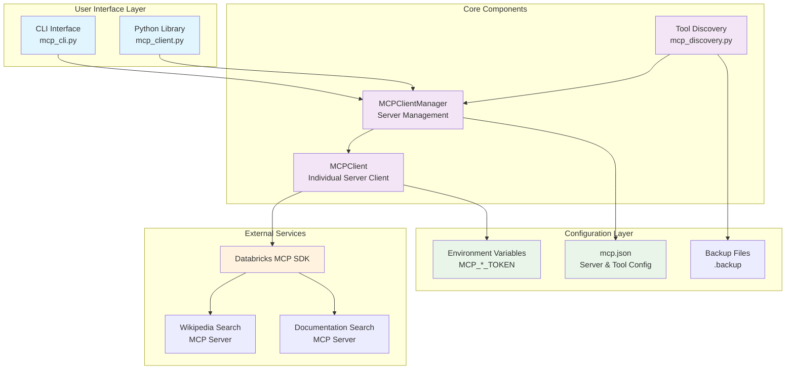

## 🔄 Data Flow

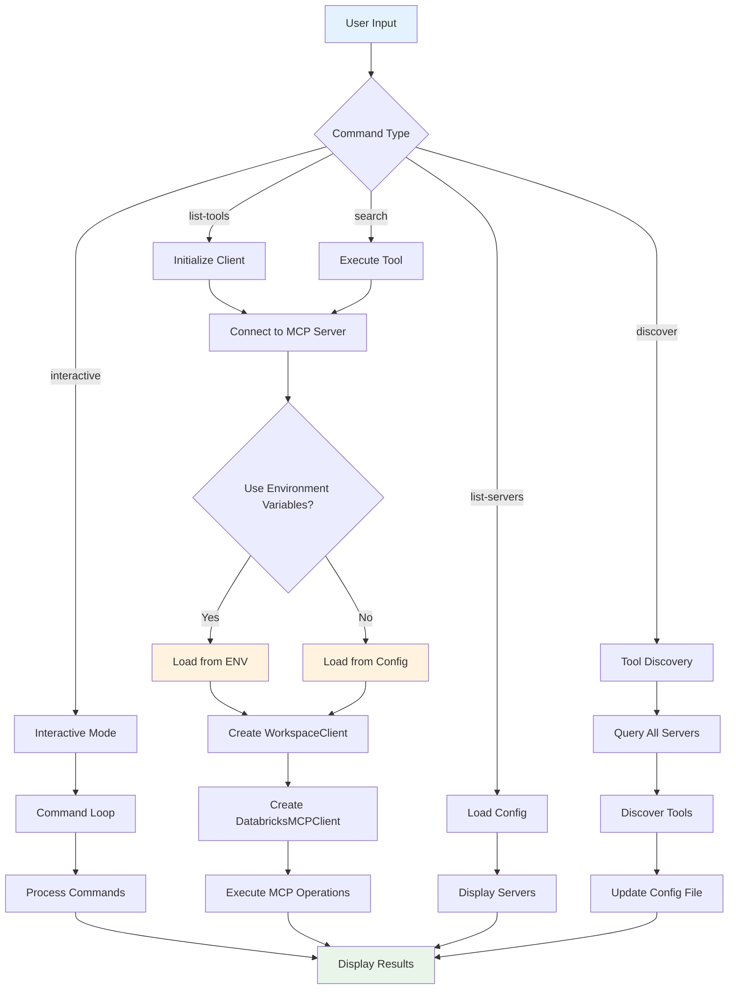

## 🛠️ Tool Discovery Workflow

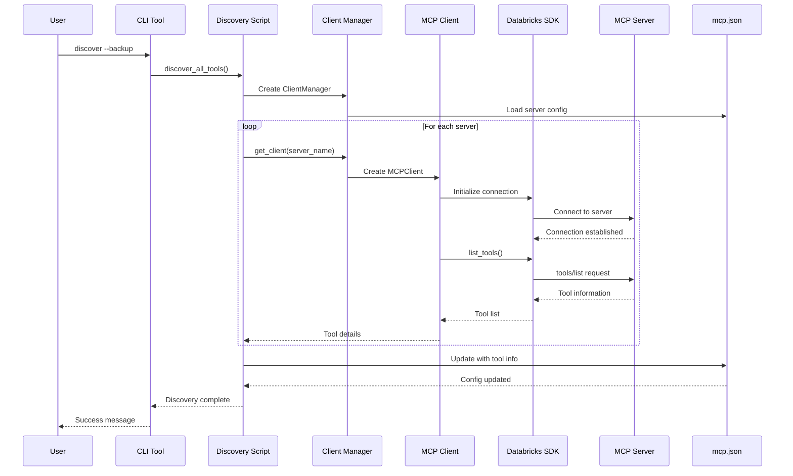

## 🔐 Authentication Flow

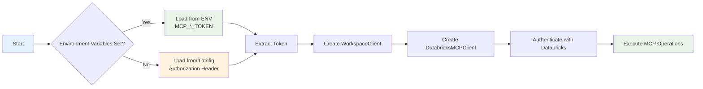

## 📋 CLI Command Structure

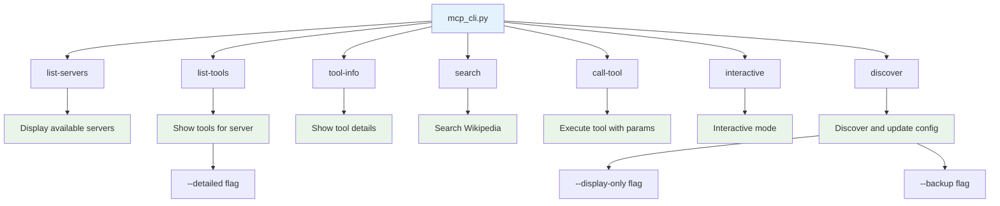

## 🔄 Configuration Management

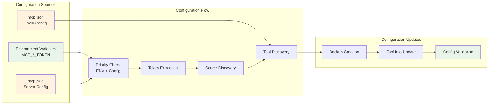

## 🎯 Usage Workflows

### Basic Usage Workflow

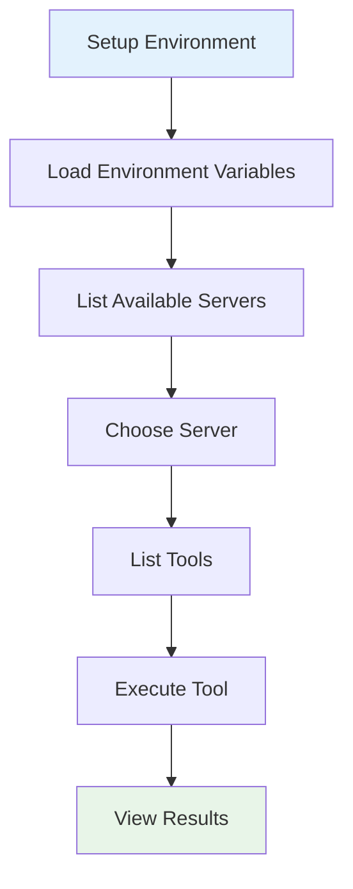

### Advanced Usage Workflow

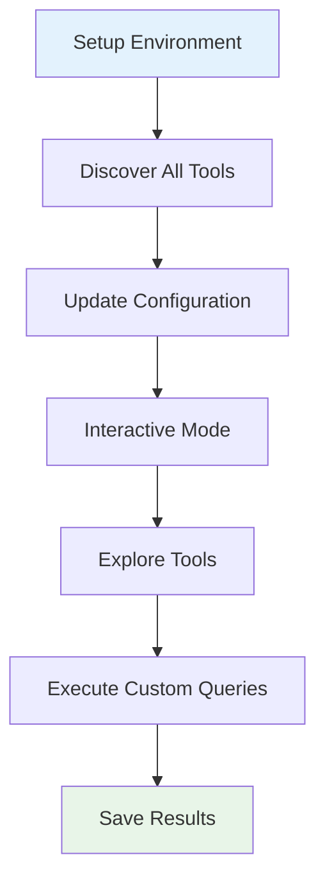

### Development Workflow

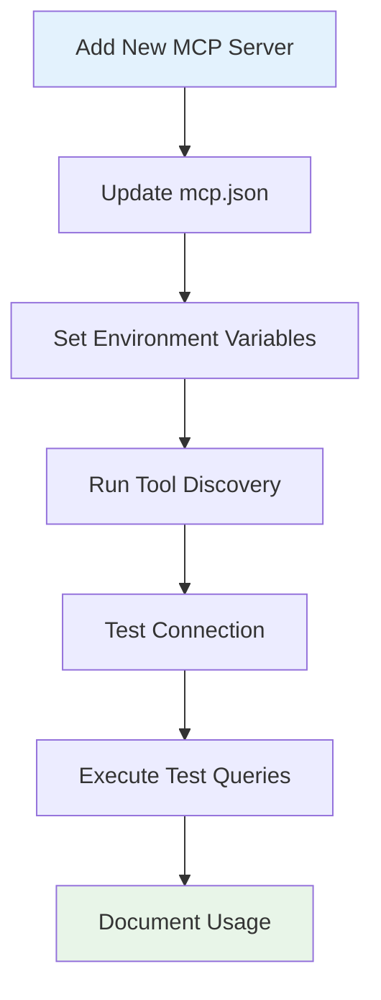

## 🏛️ Class Relationships

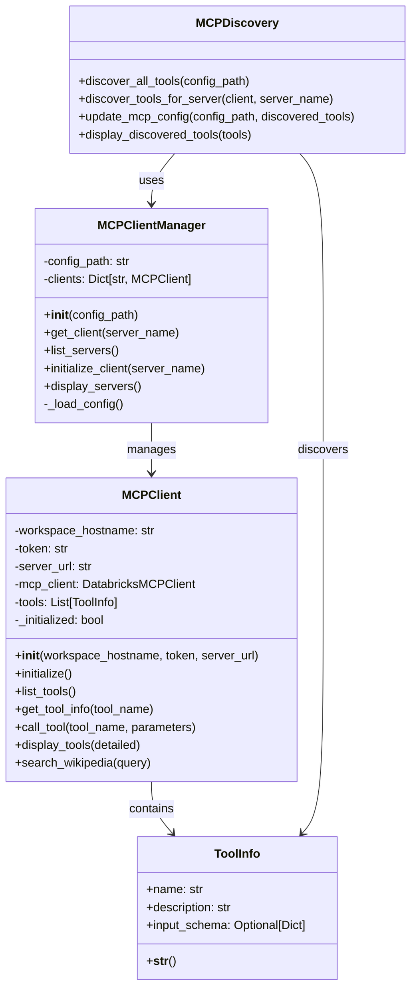

## 🔧 Component Dependencies

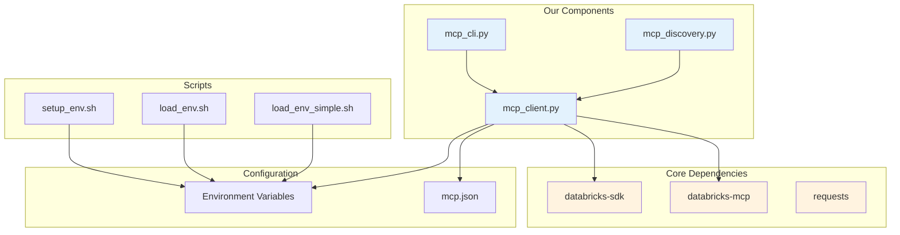

## 📊 Error Handling Flow

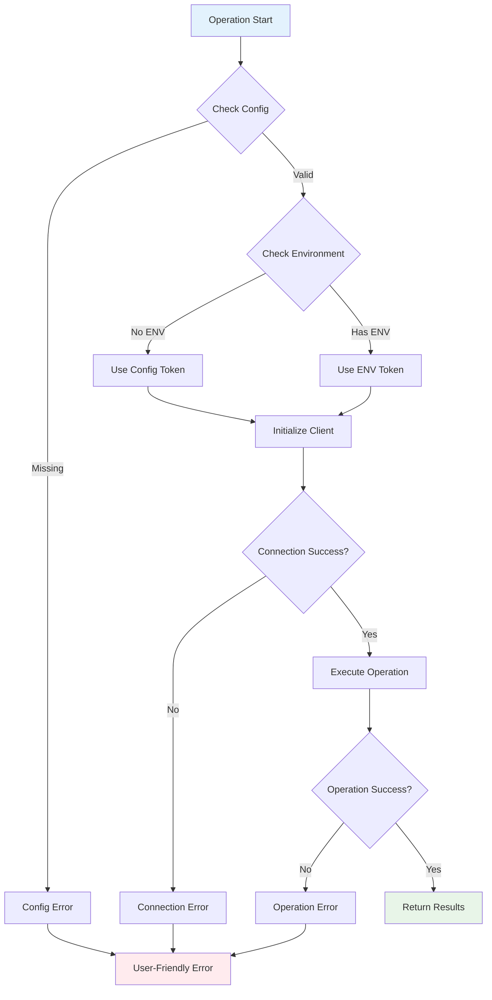

---

*These diagrams provide a comprehensive view of the MCP client architecture, data flow, and usage patterns. They help developers understand the system structure and can be used for documentation, presentations, and development planning.* 