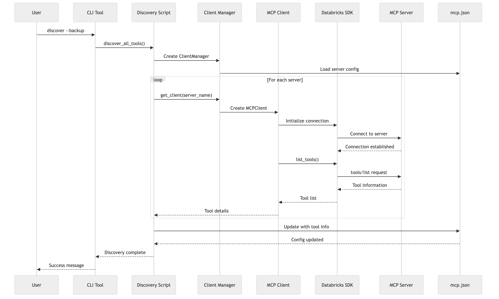

# Generated Diagrams

This directory contains automatically generated diagrams from Mermaid source files.

## Available Diagrams

### Authentication-Flow


**Formats:** [PNG (71KB)](authentication-flow.png) | [SVG (Vector)](authentication-flow.svg)

### Basic-Workflow


**Formats:** [PNG (26KB)](basic-workflow.png) | [SVG (Vector)](basic-workflow.svg)

### Class-Relationships


**Formats:** [PNG (220KB)](class-relationships.png) | [SVG (Vector)](class-relationships.svg)

### Cli-Commands


**Formats:** [PNG (28KB)](cli-commands.png) | [SVG (Vector)](cli-commands.svg)

### Component-Dependencies


**Formats:** [PNG (99KB)](component-dependencies.png) | [SVG (Vector)](component-dependencies.svg)

### Data-Flow


**Formats:** [PNG (207KB)](data-flow.png) | [SVG (Vector)](data-flow.svg)

### Detailed-Architecture


**Formats:** [PNG (183KB)](detailed-architecture.png) | [SVG (Vector)](detailed-architecture.svg)

### Error-Handling-Flow


**Formats:** [PNG (166KB)](error-handling-flow.png) | [SVG (Vector)](error-handling-flow.svg)

### Interactive-Mode-Workflow


**Formats:** [PNG (161KB)](interactive-mode-workflow.png) | [SVG (Vector)](interactive-mode-workflow.svg)

### Quick-Start-Workflow


**Formats:** [PNG (185KB)](quick-start-workflow.png) | [SVG (Vector)](quick-start-workflow.svg)

### Setup-Options


**Formats:** [PNG (356KB)](setup-options.png) | [SVG (Vector)](setup-options.svg)

### System-Overview


**Formats:** [PNG (154KB)](system-overview.png) | [SVG (Vector)](system-overview.svg)

### Tool-Discovery-Workflow



**Formats:** [PNG (208KB)](tool-discovery-workflow.png) | [SVG (Vector)](tool-discovery-workflow.svg)

### Tool-Discovery


**Formats:** [PNG (59KB)](tool-discovery.png) | [SVG (Vector)](tool-discovery.svg)

### Troubleshooting-Flow


**Formats:** [PNG (425KB)](troubleshooting-flow.png) | [SVG (Vector)](troubleshooting-flow.svg)

### Url-Discovery-Workflow


**Formats:** [PNG (299KB)](url-discovery-workflow.png) | [SVG (Vector)](url-discovery-workflow.svg)

### Usage-Examples


**Formats:** [PNG (34KB)](usage-examples.png) | [SVG (Vector)](usage-examples.svg)

## Format Benefits

- **PNG**: High-resolution raster images (2400x1800px) - ideal for viewing and embedding
- **SVG**: Vector graphics - infinitely scalable, perfect for printing and presentations

## Regenerating Diagrams

To regenerate these diagrams, run:

```bash
python generate_diagrams.py
```

**Prerequisites:**
- Node.js and npm
- Mermaid CLI: `npm install -g @mermaid-js/mermaid-cli`
