# MCP Client Workflows

This document illustrates various workflows and usage patterns for the MCP client using Mermaid diagrams.

## 🚀 Quick Start Workflow

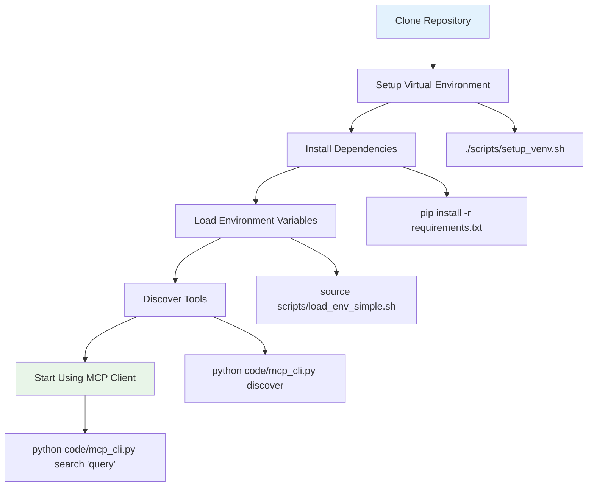

## 🔍 Tool Discovery Process

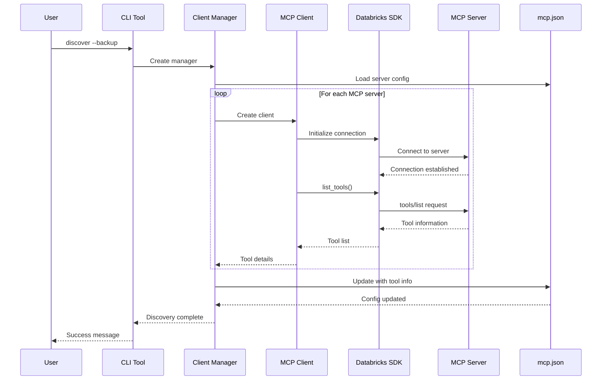

## 🔐 Authentication Workflow

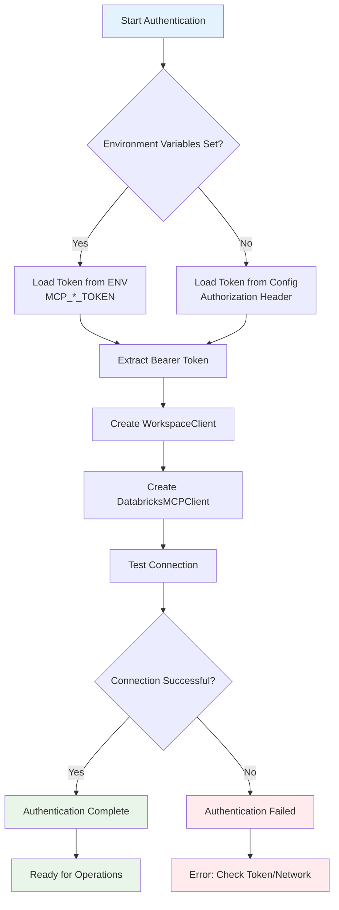

## 📋 Interactive Mode Workflow

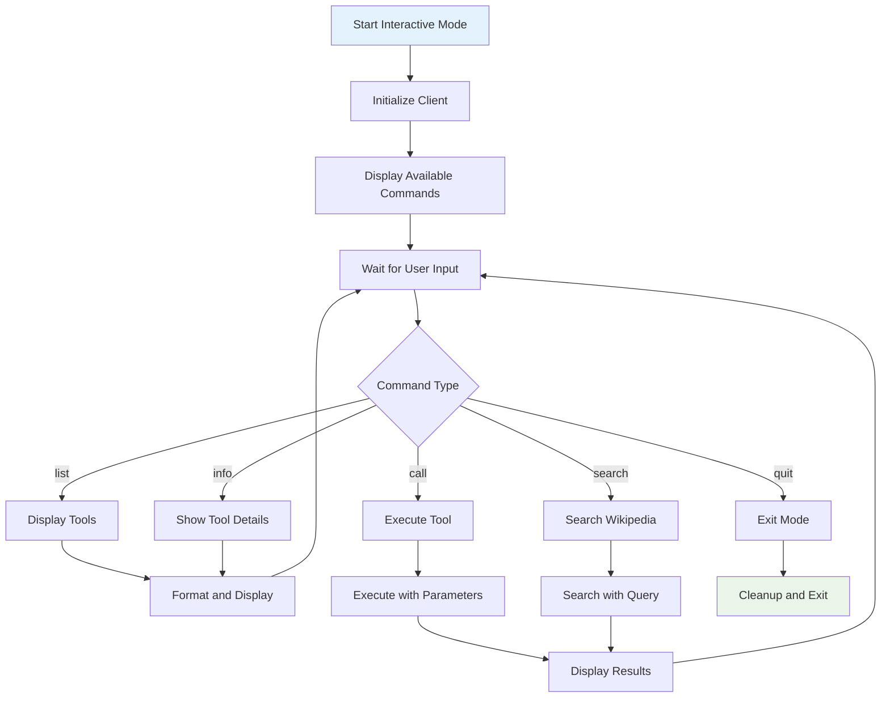

## 🔄 Configuration Management Workflow

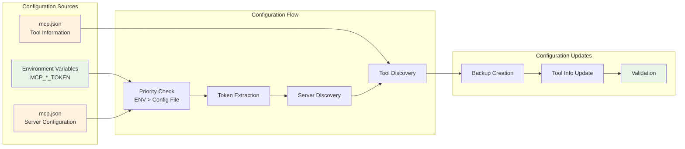

## 🛠️ Tool Execution Workflow

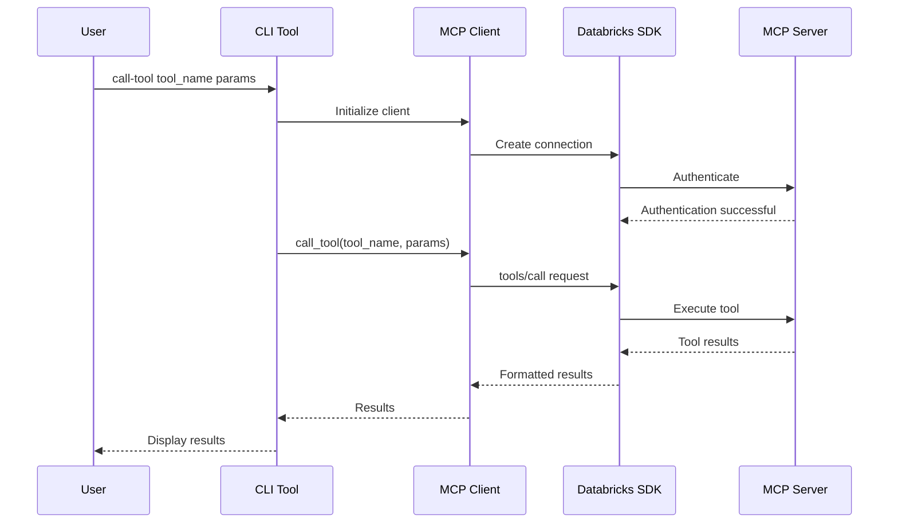

## 🔍 Search Workflow

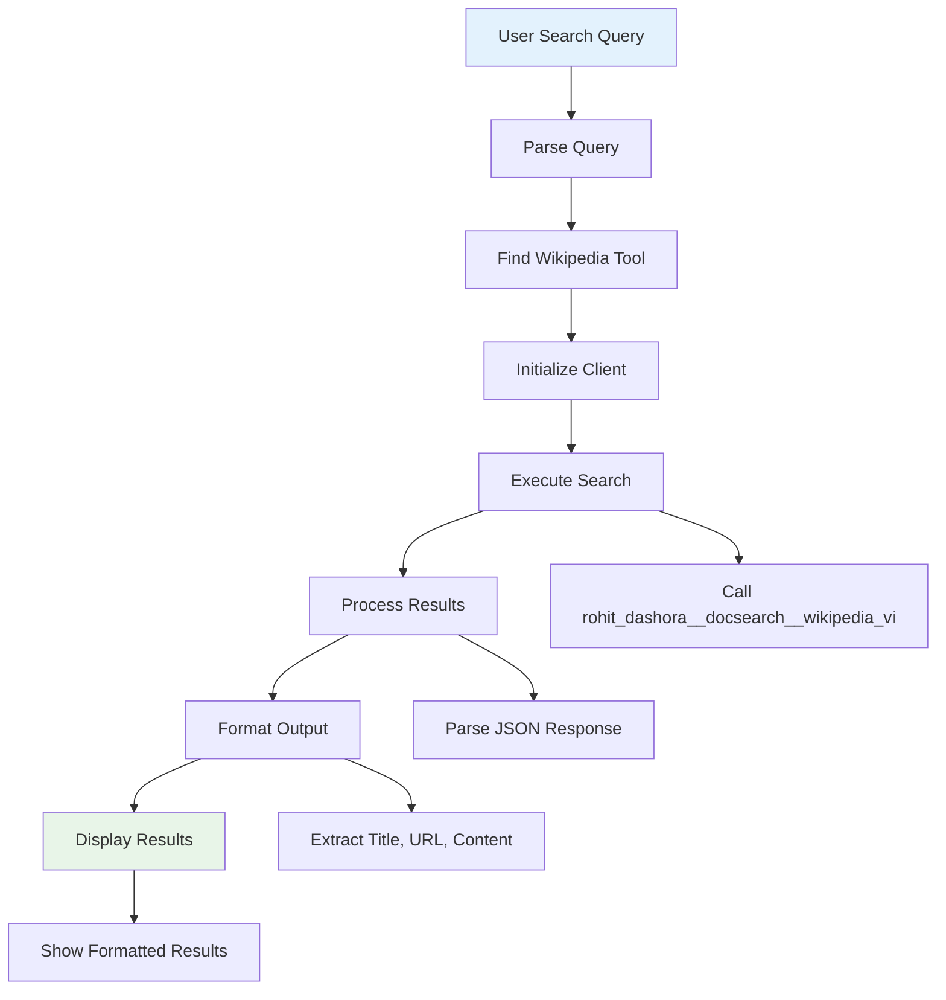

## 🚨 Error Handling Workflow

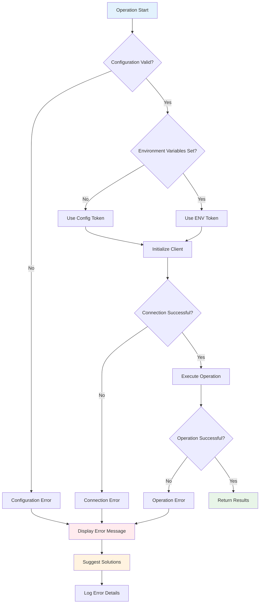

## 🔄 Development Workflow

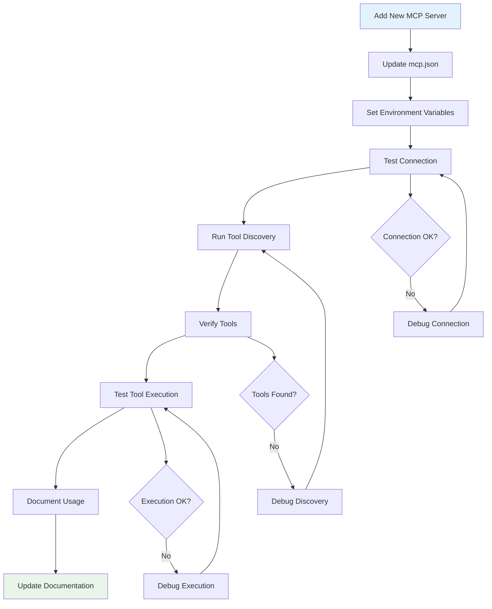

## 📊 Data Flow Architecture

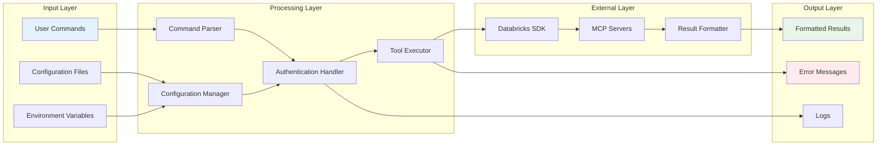

## 🎯 CLI Command Flow

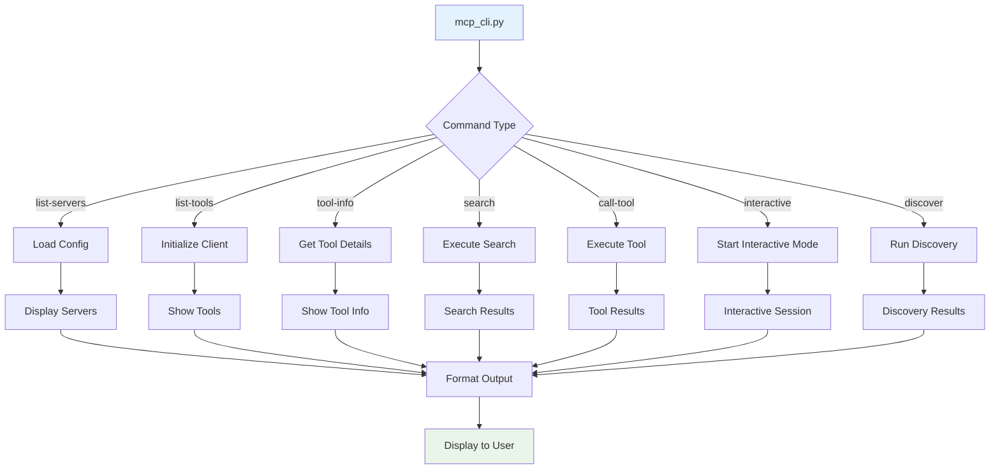

## 🔧 Maintenance Workflow

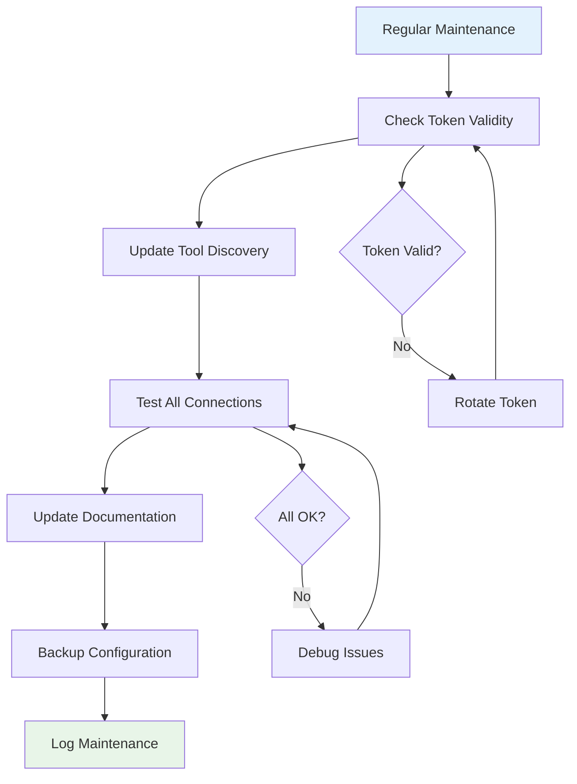

---

*These workflow diagrams provide detailed step-by-step processes for various operations in the MCP client system. They help users understand how different components interact and what to expect at each step.* 